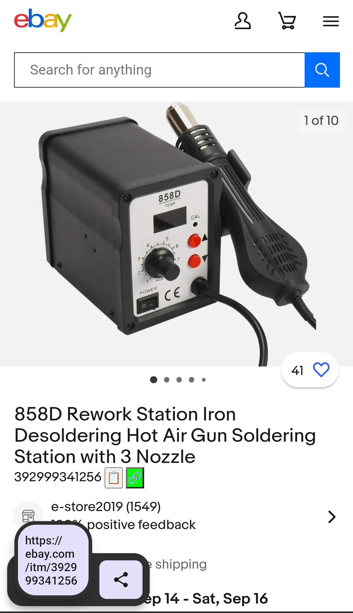

### [Discourse Lite](discourse-lite.js)
Redirects Discourse links to minimal version and adds back a few missing features.

### [eBay easy item ID](ebayitm.user.js):
Puts the item number under the title with buttons for copying it and the cleaned URL.

Sceeenshot

  

  

### [LibraryThing Copy Book (by brightcopy)](LT-copy-book_brightcopy.user.js):
Adds button to book detail page for easily adding it to your library. [Thread](https://www.librarything.com/topic/115928); [more info on GreasyFork.](https://greasyfork.org/en/scripts/440672-lt-copy-book-fixed-librarything)

### [Retro hyperlinks](retro-hyperlinks.user.js):
Underline all links and turn them blue. Underline disappears on hover, and visited links turn purple. Seems to play well with [Dark Reader](https://darkreader.org/) extension.
